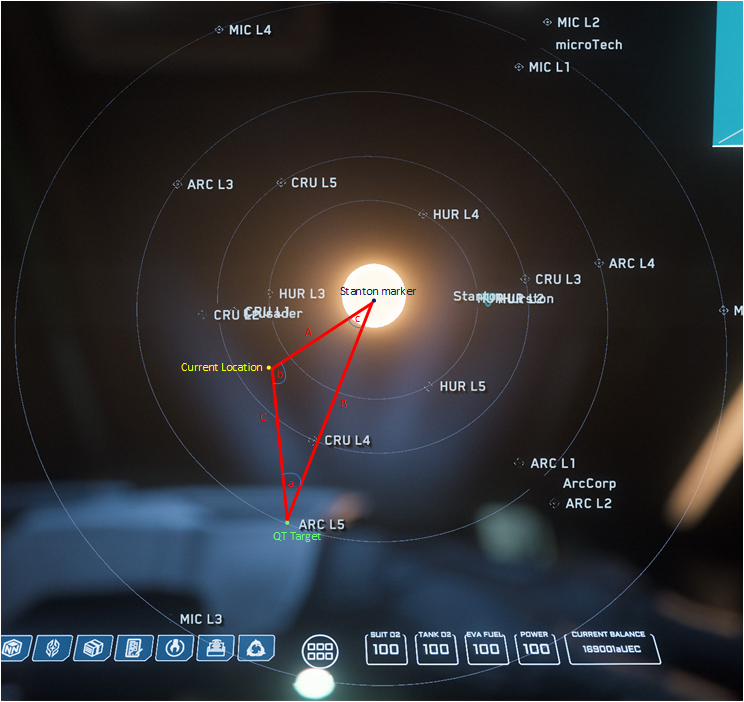

# Halo Calculator

## Objective:

In Star Citizen, calculate distance from any point in the Stanton system to the Aaron Halo. Requires user to know their current location and distance to the Stanton marker, and distance to some known location on the other side of the halo.

## Usage:

```bash
python main.py route_target distance_to_target distance_to_marker band
```

### Poisitional arguments:

- target (str): Name of target system, all lower case no spaces
- distance_to_target (int): distance in km from current location to the target location
- distance_to_marker (int): distance in km from current location to the Stanton marker
- band (int): band number (1-10), or 0 to show distances for all bands
  **(note 0 not implemented yet)**

## The Math

Using the sine and cosine given any three elements of a triangle including one side, and 2 sides or angles, we can calculate all sides and angles of the triangle.

Use the existing distances to form a triangle with three known sides the distance from current location to Stanton marker (A) and target (C), and the distance from the target to Stanton marker (B). With this we use the law of cosines to calculate the angle (a) between the path to the target and the target to the Stanton marker. As we travel to the target this angle does not change.



The forumla used for this is:

$a = acos ({ B^2 + C^2 - A^2 \over 2BC})$

We are now able to form a triangle with three known components, the distance from the target to the Stanton marker, the angle previously calculated, and the distance from the Standon marker to the desired path. Using the law of sines we can not calculate the length of the path at our desired band, or where we need to stop to land in the band

The forumlas used for this are:

${sin(b) \over b} = {sin(a) \over a}$

therefore:

$b = asin({B * {sin(a) \over a}})$

three angles of triangle must add up to $\pi$ radians (or $180\degree$) so $c = \pi-a-b$

Finnally solve for C

${C \over sin(c)} = {a \over sin(a)}$

therefore:

$C = {a \over sin(a)} * sin(c)$
